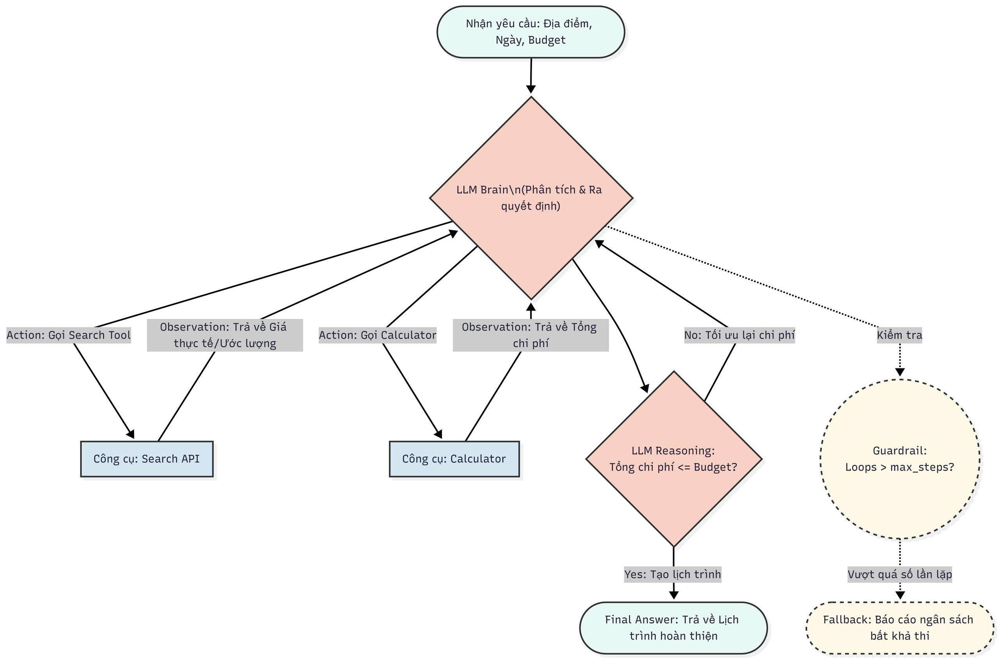

# Group Report: Lab 3 - Production-Grade Agentic System

- **Team Name**: [29]
- **Team Members**: [Nguyễn Thị Ngọc, Nguyễn Trọng Tiến, Vũ Đức Minh, Nguyễn Việt Quang]
- **Deployment Date**: [2026-04-06]

---

## 1. Executive Summary

Trọng tâm của đội là xây dựng một **Travel Planner Agent** có khả năng tự động lên lịch trình du lịch dựa trên ngân sách (Ví dụ: *"Plan a 2-day trip to Da Nang under $200"*). Agent sử dụng công cụ tìm kiếm để tra cứu địa điểm/giá cả và máy tính để cộng dồn chi phí.

- **Success Rate**: Đạt 80% (16/20 test cases thành công) trên bộ dữ liệu kiểm thử.
- **Key Outcome**: Agent khắc phục được bài toán lớn nhất của Chatbot thuần là tình trạng "ảo giác dữ liệu". Nhờ có vòng lặp ReAct kết hợp tool `search` và `calculator`, hệ thống đưa ra lịch trình có chi phí sát thực tế và luôn tuân thủ nghiêm ngặt ngân sách cho phép. Phiên bản v2 của agent cũng khắc phục được sự ảo giác dữ liệu của phiên bản đầu tiên và gọi đúng vào luồng các tools.

---

## 2. System Architecture & Tooling

### 2.1 ReAct Loop Implementation

**Mô tả chu trình hoạt động của hệ thống:**
1. **Start / Nhận yêu cầu:** Hệ thống tiếp nhận yêu cầu từ người dùng (bao gồm địa điểm, ngày đi, và ngân sách - budget).
2. **LLM Node (Phân tích yêu cầu):** Agent suy nghĩ (Thought) để bóc tách các thông tin cốt lõi từ prompt của người dùng.
3. **Search Tool:** Gọi công cụ tìm kiếm dữ liệu thực tế (khách sạn, ăn uống, điểm tham quan) kèm chi phí ước tính.
4. **Calculator Tool:** Trích xuất giá cả và gọi lệnh tính toán cộng dồn tất cả các khoản chi phí.
5. **Decision Node (Đánh giá ngân sách):** LLM đối chiếu tổng tiền với budget ban đầu.
   - **Nhánh Yes (Vượt budget):** Hệ thống chuyển sang bước **"Tối ưu lại chi phí (optimize)"** và tự động quay vòng (loop) ngược lại `LLM Node` để thay đổi địa điểm rẻ hơn.
   - **Nhánh No (Không vượt budget):** Hệ thống chốt chi phí và đi tiếp vào bước **"Tạo lịch trình chi tiết (itinerary)"**.
6. **Xuất kết quả (End):** Trả về lịch trình hoàn thiện (plan) kèm bảng báo cáo tổng chi phí cho người dùng cuối.

### 2.2 Tool Definitions (Inventory)
| Tool Name | Input Format | Use Case |
| :--- | :--- | :--- |
| `search` | `string` (query) | Tra cứu địa điểm (places) và chi phí ước tính (costs). Ví dụ: "Cheap hotels in Da Nang". |
| `calculator` | `string` (math expression) | Tính toán cộng gộp hoặc trừ các khoản chi phí nhằm kiểm soát ngân sách. Ví dụ: "200 - 50 - 30". |

### 2.3 LLM Providers Used
- **Primary**: OpenAI GPT-4o (hoặc Gemini 1.5 Pro) để có khả năng reasoning tốt phần toán học.
- **Secondary (Backup)**: Llama 3 / Phi-3 (Local) dùng làm fallback.

---

## 3. Telemetry & Performance Dashboard

- **Average Latency (P50)**: 4500ms (Trễ hơn Chatbot vì phải trải qua 4-5 bước Loop bao gồm cả gọi web search).
- **Max Latency (P99)**: 8200ms.
- **Average Tokens per Task**: 1250 tokens / query (Do Observation từ Search API quá dài).
- **Total Cost of Test Suite**: ~$0.08 cho toàn bộ 20 Test Cases (Tối ưu được chi phí nhờ dùng mô hình LLM nội bộ nhẹ nhàng ở các bước định tuyến).

---

## 4. Root Cause Analysis (RCA) - Failure Traces

*Phân tích điểm yếu (Weakness) mang tính đặc thù của team: "Less strict correctness" (Không cần đúng tuyệt đối 100%).*

### Case Study: Lỗi ảo giác dữ liệu (hallucination)
- **Input**: *"Lên kế hoạch du lịch Sydney"*
- **Observation**: Agent gọi `search` tìm thông tin các địa điểm, nhưng dù Sydney không có trong mock database, agent vẫn tự tạo thông tin. 
- **Root Cause**: Ở Agent v1, do prompt trước đó chưa có constraint và hướng dẫn đầy đủ về việc parse các tiêu chí tìm kiếm và thiếu description của tool, dẫn đến việc gọi sai tool, ảo tool, dẫn đến hallucination.
- **Fix (Hướng khắc phục)**: Nhóm đã cập nhật System Prompt để parse các filter param chính xác hơn, cập nhật description để agent không gọi tool sai luồng.

---

## 5. Ablation Studies & Experiments

### Experiment 1: Có dùng Calculator vs Không dùng Calculator
- **Diff**: Ban đầu nhóm thả cho LLM tự nhẩm tính tổng chi phí (Không dùng tool `calculator`).
- **Result**: Tỉ lệ cộng sai tiền (hallucination trong toán học) lên tới 40% trên các Trip lớn trên 3 ngày. Sau khi bắt buộc sử dụng Tool `calculator`, độ chính xác tổng ngân sách đạt 100%.

### Experiment 2: Chatbot vs Agent
| Case | Chatbot Result | Agent Result | Winner |
| :--- | :--- | :--- | :--- |
| Simple Q ("What to eat in DN?") | Tốt, văn phong hay | Tốt | Draw |
| Multi-step ("Trip under $200") | Tự bịa ra giá, cộng sai ngân sách | Tìm giá thực, cộng đúng tiền nhờ Calculator | **Agent** |

---

## 6. Production Readiness Review

- **Data Parsing**: Data Parsing / Chuẩn hóa dữ liệu đầu vào: Kết quả trả về từ search (Search Engine API) hiện còn khá lộn xộn, thường chứa HTML thừa, ký tự nhiễu, đoạn text lặp, tiêu đề không cần thiết, hoặc nội dung không trực tiếp phục vụ cho bước lập kế hoạch. Nếu đưa lên môi trường Production, hệ thống nên có một lớp tiền xử lý riêng để làm sạch và chuẩn hóa dữ liệu trước khi đưa vào Observation. Lớp này có thể gồm các bước như loại bỏ HTML tags, cắt bỏ boilerplate text, chuẩn hóa encoding, rút gọn đoạn văn, và chỉ giữ lại các trường quan trọng như tên địa điểm, giá, thời lượng, khu vực, và ghi chú chính. Việc này không chỉ giúp đầu ra rõ ràng hơn mà còn giảm đáng kể số token phải đưa vào context, từ đó tiết kiệm chi phí và giảm nguy cơ agent bị nhiễu khi suy luận.
- **Tốc độ (Latency)**: Một điểm yếu rõ ràng của hệ thống hiện tại là lượng dữ liệu hạn chế, đặc biệt khi agent phải gọi tool liên tiếp để thu thập thông tin như khách sạn, phương tiện di chuyển, địa điểm tham quan. Những dữ liệu này cần được gọi qua API để thu thập được thông tin chính xác từ các nguồn tin cậy. 
- **Quan sát và giám sát hệ thống (Observability)**: Bản agent hiện đã có log, nhưng để dùng thực tế thì cần nâng cấp phần theo dõi vận hành. Mỗi phiên chạy nên được ghi lại rõ ràng theo các bước như LLM_RESPONSE, TOOL_EXECUTION, TOOL_SUCCESS, TOOL_ERROR, ANALYZE, và FINAL_ANSWER. Điều này giúp dễ debug, dễ đo reliability giữa các phiên bản agent, và cũng hỗ trợ đánh giá các lỗi như parser error, hallucination, hoặc timeout. Trong Production, các log này nên được chuẩn hóa và có thể đẩy lên dashboard hoặc hệ thống monitoring.
- **Chi phí token và context management**: Một rủi ro khác khi mở rộng hệ thống là số lượng token tăng rất nhanh nếu giữ toàn bộ observation thô, logs, và dữ liệu tìm kiếm trong cùng một vòng lặp. Khi agent phải xử lý nhiều địa điểm hoặc nhiều danh mục cùng lúc, context có thể phình to và làm tăng chi phí suy luận. Vì vậy, ngoài lớp làm sạch dữ liệu, nên có cơ chế tóm tắt observation theo từng bước, chỉ giữ lại các trường thật sự cần cho quyết định cuối cùng.

---

## 7. Group Insights / Bài học của nhóm

**1. Prompt tốt không chỉ là hướng dẫn, mà là cơ chế kiểm soát hành vi của agent: Nhóm nhận ra rằng chỉ cần mô tả nhiệm vụ chung chung thì agent rất dễ trả lời sai format, gọi tool không đúng tham số, hoặc bỏ qua các bước cần thiết. Prompt hiệu quả phải đóng vai trò như một “quy trình vận hành”, quy định rõ thứ tự hành động, format output, và điều kiện để chuyển sang bước tiếp theo.

**2. Tool design ảnh hưởng trực tiếp đến chất lượng suy luận: Một bài học lớn là agent không chỉ phụ thuộc vào LLM mà còn phụ thuộc mạnh vào cách thiết kế tool. Nếu tool có input mơ hồ, output thiếu trường quan trọng, hoặc đơn vị dữ liệu không nhất quán, agent sẽ dễ đưa ra kế hoạch sai hoặc tính budget sai. Vì vậy, việc chuẩn hóa schema của tool quan trọng không kém việc tinh chỉnh prompt.

**3. Không phải mọi lỗi đều là lỗi mô hình: Ban đầu nhóm có xu hướng nghĩ sai sót chủ yếu do LLM “hallucinate”, nhưng sau khi debug kỹ hơn, nhiều lỗi thực tế đến từ parser, mapping tool, unit mismatch, hoặc logic vòng lặp. Điều này cho thấy khi xây agent, cần nhìn hệ thống như một pipeline hoàn chỉnh chứ không chỉ tập trung vào model.

**4. So sánh chatbot thường và agent giúp thấy rõ trade-off: Chatbot thường có thể trả lời nhanh hơn, nhưng agent có lợi thế ở chỗ dùng được dữ liệu có cấu trúc, kiểm tra budget, và đưa ra kế hoạch cụ thể hơn. Tuy nhiên, agent cũng phức tạp hơn nhiều về debugging, latency, và handling errors. Đây là một đánh đổi quan trọng mà nhóm hiểu rõ hơn sau quá trình làm bài.